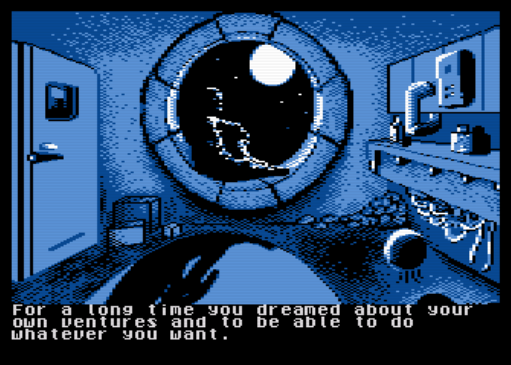
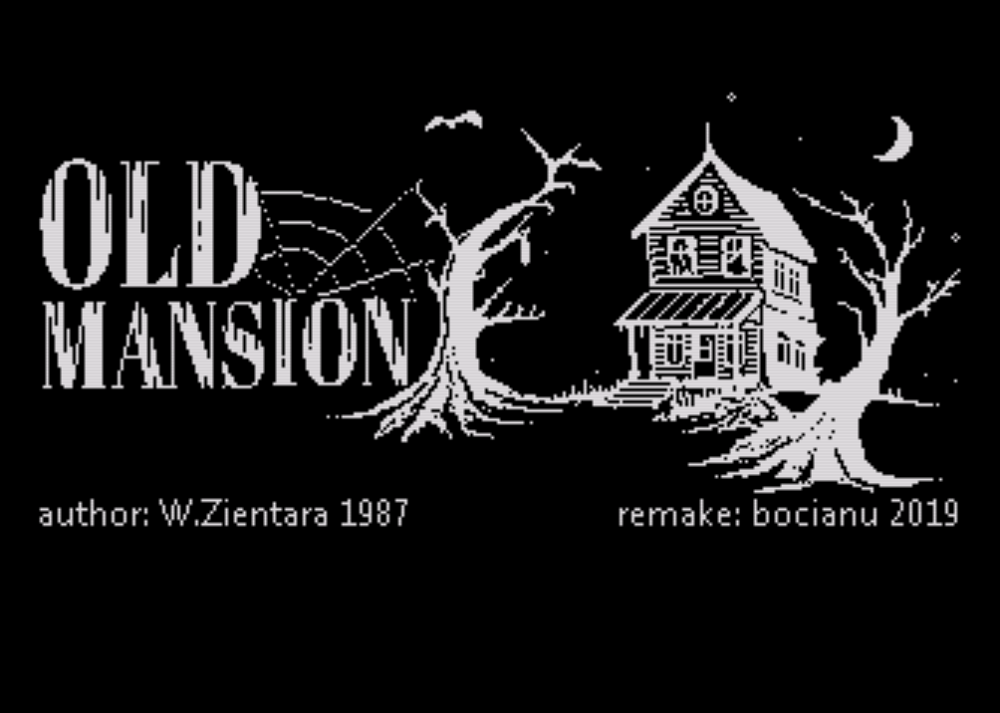

# [Mad-Pascal](https://github.com/tebe6502/Mad-Pascal)

**Mad-Pascal**  (MP) is a 32-bit **Turbo Pascal** compiler for **Atari XE/XL**. By design, it is compatible with the **Free Pascal Compilator** (FPC) (the `-MDelphi` switch should be active), which means the possibility of obtaining executable code for **XE/XL**, **PC** and every other platform for which **FPC** exists. **MP** is not a port of **FPC**; it has been written based on of **SUB-Pascal** (2009), **XD-Pascal** (2010), the author of which is [Vasiliy Tereshkov](mailto:vtereshkov@mail.ru).

## [Releases](https://github.com/tebe6502/Mad-Pascal/releases)

You can find Mad-Pascal builds for **Windows** [here](https://github.com/tebe6502/Mad-Pascal/releases).

## [Documentation](https://tebe6502.github.io/mad-pascal-en-mkdocs/)

[Here](https://tebe6502.github.io/mad-pascal-en-mkdocs/) you will find the latest version of the documentation.

---

## [Projects](https://tebe6502.github.io/mad-pascal-en-mkdocs/projects/)

---

### Star Vagrant

* author: MADRAFi
* platform: A8
* [home page](http://madsoft.us/)
* [sources](https://github.com/MADRAFi/StarVagrant)

### Old Mansion

* author: bocianu
* platform: A8
* [home page](http://bocianu.atari.pl/blog/starydom)
* [sources](https://gitlab.com/bocianu/oldmansion)