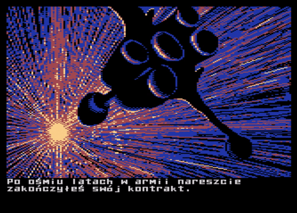

# [Mad-Pascal](https://github.com/tebe6502/Mad-Pascal)

**Mad-Pascal** (MP) jest 32-bitowym kompilatorem **Turbo Pascala** dla **Atari XE/XL**. W założeniu jest kompatybilny z **Free Pascal Compilator** (FPC) (przełącznik `-MDelphi` powinien być aktywny), co oznacza możliwość otrzymania kodu uruchomieniowego dla **XE/XL**, **PC** i każdej innej platformy dla której istnieje **FPC**. **MP** nie jest portem **FPC**, został napisany na podstawie kompilatorów **SUB-Pascal** (2009), **XD-Pascal** (2010), których autorem jest [Vasiliy Tereshkov](mailto:vtereshkov@mail.ru).

## [Wydanie](https://github.com/tebe6502/Mad-Pascal/releases)

Pod powyższym *linkiem* znajdziesz kompilacje **Mad-Pascal** dla systemu **Windows**.

## [Dokumentacja](https://tebe6502.github.io/mad-pascal-mkdocs/)

Pod powyższym *linkiem* znajdziesz najnowszą wersję dokumentacji.

---

## [Projekty](https://tebe6502.github.io/mad-pascal-mkdocs/projekty/)

---

### Star Vagrant

* autor: MADRAFi
* platforma: A8
* [strona domowa](http://madsoft.us/)
* [źródła](https://github.com/MADRAFi/StarVagrant)

### Stary Dom

* autor: bocianu
* platforma: A8
* [strona domowa](http://bocianu.atari.pl/blog/starydom)
* [źródła](https://gitlab.com/bocianu/oldmansion)